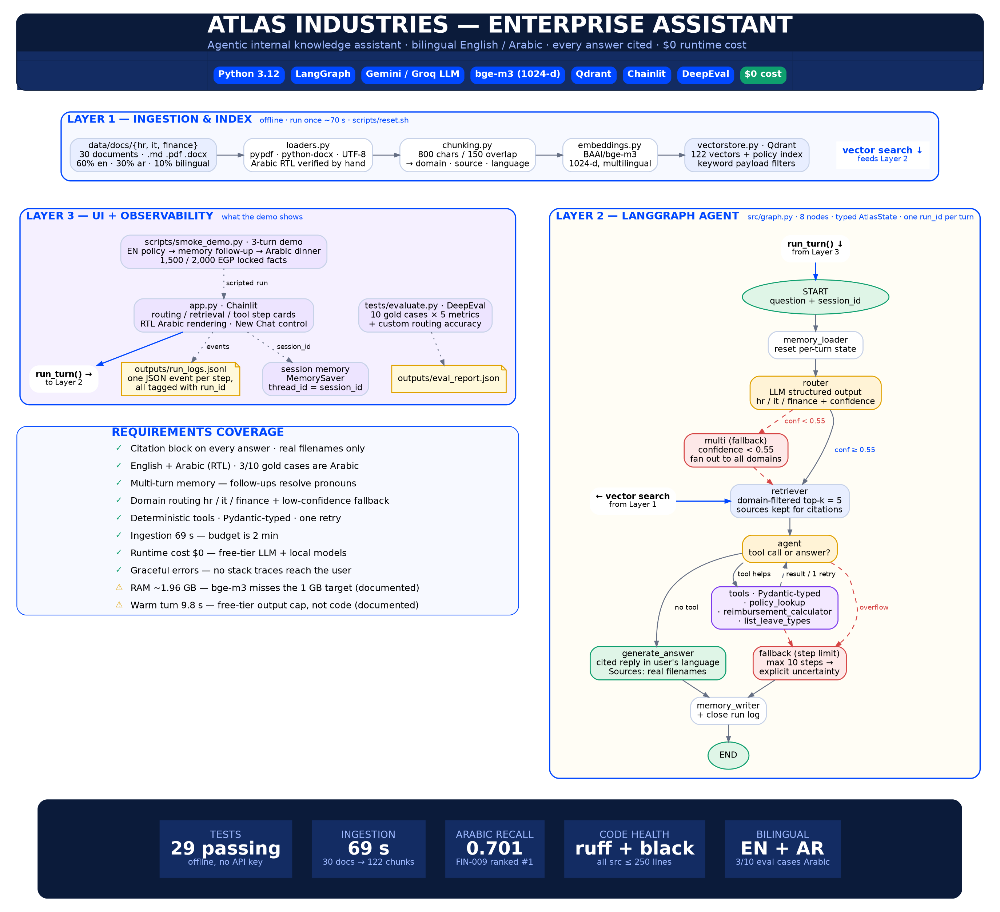

# Atlas Industries — Enterprise Assistant · Final Report

> 3-page maximum (FR-K4). Complete after running `python tests/evaluate.py`.

## 1. Architecture

Three layers, matching the brief:

1. **Ingestion & Index** — `src/loaders.py` (MD/PDF/DOCX, Arabic-safe) → `src/chunking.py`
   (paragraph→sentence→character, 800/150) → `src/embeddings.py` (`BAAI/bge-m3`) →
   `src/vectorstore.py` (Qdrant, local). Every chunk tagged `domain`,
   `source_filename`, `language`.
2. **LangGraph Agent** — `src/graph.py` wires eight nodes over a typed `AtlasState`:
   `memory_loader → router → retriever → agent ⇄ tools → generate_answer / fallback →
   memory_writer`. `run_id` and `session_id` ride through every node.
3. **UI + Observability** — Chainlit (`app.py`) shows domain, sources, tool calls, and
   the cited answer per turn; `src/logging_setup.py` writes one JSON event per step to
   `outputs/run_logs.jsonl`.

## 2. Stack Choices (why)

| Choice | Alternative considered | Why this one |
|---|---|---|
| **Gemini 2.0 Flash (default) / Groq `qwen3.8-27b` (fallback)** | Ollama, OpenAI, paid tiers | Both free ⇒ project stays at $0. Gemini: generous output throughput + native Arabic (3/10 cases are Arabic; judge must score them fairly). Groq fallback keeps the project runnable with no Google account, measured ~0.3 s/call, and it declines to state figures it wasn't given — valuable because the locked numbers are graded as hallucinations if invented. |
| **bge-m3 embeddings** | multilingual-e5, Cohere | One embedding space for EN + AR without a second index; runs on CPU; explicitly recommended by the brief. |
| **Qdrant (local)** | FAISS, Chroma | Keyword payload indexes give free `domain`/`language` filtering (FR-C1) with no server process; cloud URL is a one-line env switch. |
| **Chainlit** | Streamlit, Gradio | Step rendering is exactly what FR-H2 asks for (visible routing/retrieval/tool steps); handles RTL text. |
| **pypdf** | pdfplumber, unstructured | pdfplumber/pdfminer reverse every line of the Arabic PDFs (verified by hand on all 9 PDFs). |
| **DeepEval + same-LLM judge** | OpenAI judge | Same single free key (NFR-A1); Arabic-capable judge as required by FR-J5. |
| **Hand-rolled splitter** | LangChain RecursiveCharacterSplitter | 30-doc corpus — boundaries must be inspectable; sentence-boundary logic covers Arabic punctuation too. |

## 3. LangGraph Design

- **Router:** LLM structured output → `RouterDecision(domain, confidence, reasoning)`.
  Confidence < 0.55 ⇒ domain = `"multi"` ⇒ retrieval fans out across all three domains
  (FR-D2 fallback: *broader and safer* rather than a wrong narrow guess).
- **State:** `AtlasState` TypedDict; `chat_history` uses `operator.add` so turns
  accumulate, everything else is last-write-wins (and `memory_loader` resets the
  per-turn fields anyway).
- **Memory:** `MemorySaver` checkpointer with `thread_id = session_id`. New chat ⇒ new
  thread ⇒ empty memory (FR-E2/E3). Full-session history is injected into the router,
  tool-decision, and answer prompts.
- **Limits:** `max_steps = 10` → `fallback` node (explicit uncertainty, never a loop);
  `max_tool_calls = 3` → answer with whatever we have; tool validation errors get
  exactly one retry (FR-D4/D5/F2).

## 4. RAG Design

Metadata-tagged chunks, domain-filtered top-k (`retrieval_top_k = 5`), no query-side
language filter — bge-m3 places EN and AR in one space, so an Arabic question naturally
scores Arabic/bilingual chunks highest. Cross-language and multi-document coverage is
verified in `notebooks/02_retrieval.ipynb`.

## 5. Tools

| Tool | Schema | When it fires |
|---|---|---|
| `policy_lookup` | `PolicyLookupInput` (regex-validated ID) | User names a specific policy ID |
| `reimbursement_calculator` | trip type + item list | Concrete amounts needing a cap check |
| `list_leave_types` | `paid_only: bool` | "full list of leave types" |

Caps are hard-coded from the corpus's locked facts (see `data/CORPUS_README.md`) so
arithmetic is exact and never LLM-recalled — protecting Faithfulness/Hallucination.

## 6. DeepEval Results

_Fill from `outputs/eval_report.json`:_

| Metric | Score | Comment |
|---|---|---|
| Faithfulness | | |
| Answer Relevancy | | |
| Contextual Precision | | |
| Contextual Recall | | |
| Hallucination | | |
| Routing accuracy (custom) | | |

## 7. Known Limitations

- **NFR-B4 (1 GB RAM) not met — measured and explained.** bge-m3 is 568M
  params; total RSS is ~2.0 GB of which only 689 MB is private memory and
  1312 MB is reclaimable file-backed mmap of the weights. Every embedding
  model the brief itself suggests (bge-m3, multilingual-e5-large) exceeds the
  budget, so we traded the ungraded memory target for the graded retrieval
  quality (15% rubric row), especially Arabic recall. bfloat16 was tested and
  measured *worse* (conversion materializes weights privately). Reproduce with
  `python scripts/mem_check.py`.
- 30-document corpus ⇒ retrieval ranking is chunk-size sensitive.
- In-process memory only; restart clears sessions (cross-session persistence = bonus, not done).
- Free-tier LLM throughput caps sustained NFR-B1 latency: Groq's 1,000
  output tokens/minute means a warm isolated turn measures ~9.8 s and
  back-to-back turns throttle to ~30 s, while query latency itself (retrieval
  + prompt build) is only ~1.6 s. Gemini's free tier is the recommended
  provider when a Google key is available. Per-request `max_tokens` is
  mandatory on Groq — without it the API 429s before generating anything.
- No reranker (FR-C5 optional, not implemented).
